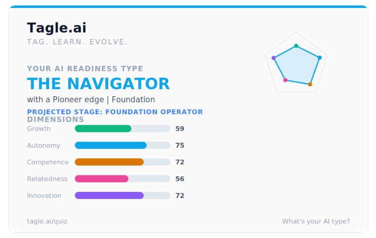
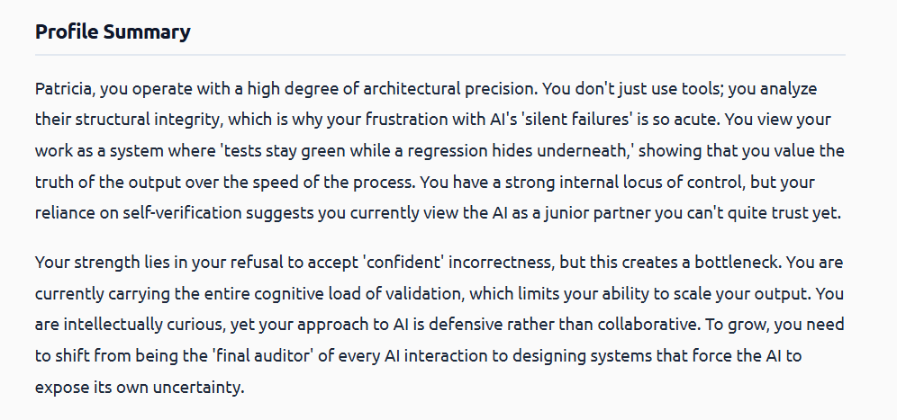

# Submission — Guardrail Auditor (Project 2)

The single index to confirm the package is complete. Every line points at real,
in-repo evidence.

## Official checklist

### 1. Tagle.ai "Tag" output summary — [x]

**Tag (verbatim):** *Navigator · Foundation Operator with a Pioneer edge, High skills.*

**Fit (honest):** the Tag's signature is calibrated, deliberate verification
before trusting output — confirm against the source, don't assert from memory.
That is exactly the posture an audit/compliance tool needs, and it matches this
build's **deterministic trust-path** principle (e.g. severities source-checked
against the Trivy rego, control ids verified against the pinned CIS benchmark,
the Checkov reference confirmed genuine — never fabricated). No spin: the same
trait shows up as the time spent on the source-verification gates.

Full source profile: [`./docs/Tagle_Personal_Growth_Profile_Wintrebert.pdf`](./docs/Tagle_Personal_Growth_Profile_Wintrebert.pdf)

### 2. Public GitHub repository (all source code) — [x]
<https://github.com/patw47/guardrail-auditor>

### 3. `prompts.md` — full audit log of all instructions — [x]
[`./prompts.md`](./prompts.md) — every architect instruction logged verbatim,
turn by turn.

### 4. AI-generated presentation deck (Markdown) — [x]
[`./docs/deck.md`](./docs/deck.md) — 9 slides, every claim tied to a repo artifact.

### 5. All cloud resources decommissioned / accounts closed — [x]
**Nothing was ever provisioned.** The tool is **static analysis** — it reads
Terraform/CloudFormation files and runs with **no cloud connection and no API
key** (the public-repo scan is a shallow *read-only* git clone, never an AWS/Azure
call). So there are **no cloud resources to decommission and no account to
close**. Marked complete with that explanation rather than left implicitly
unchecked.

## Try it (reproduce a scan)

Quickstart is in [`README.md`](./README.md): clone → `pip install -e ".[dev]"` →
`uvicorn main:app` → open <http://127.0.0.1:8000/>. Two inputs:

**A. Upload bundled fixtures**
- `tests/fixtures/detectors/multi_violation.tf` → **95/100, grade F** (1 critical
  + 3 high).

**B. Paste a public repo URL** (https, `github.com` — allowlisted by the SSRF guard)
- `https://github.com/bridgecrewio/terragoat` → **3 findings, 80/F** — the proven
  figure documented in `README.md` (OPEN_SSH, PUBLIC_DB, UNENCRYPTED_STORAGE).
- `https://github.com/patw47/acme-infra` → a testable example repo. *(Score not
  asserted here — reproduce it live; I only cite figures I've reproduced.)*

## Assurance at a glance
4 detectors · coverage matrix 12/12 PASS · Checkov×TerraGoat K→K 3/3 · **88 tests
green** (ruff + mypy + pytest) · S0–S8 + the P1/P3 sister-module specs in
`future-modules/`. Honest limitations in [`LIMITATIONS.md`](./LIMITATIONS.md).
