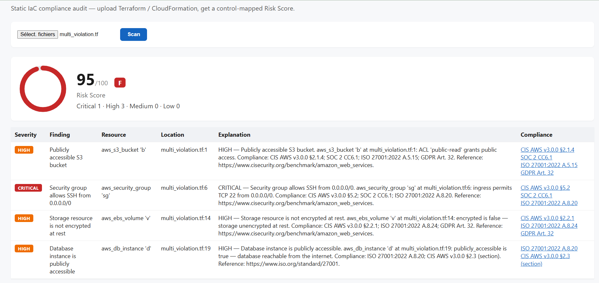
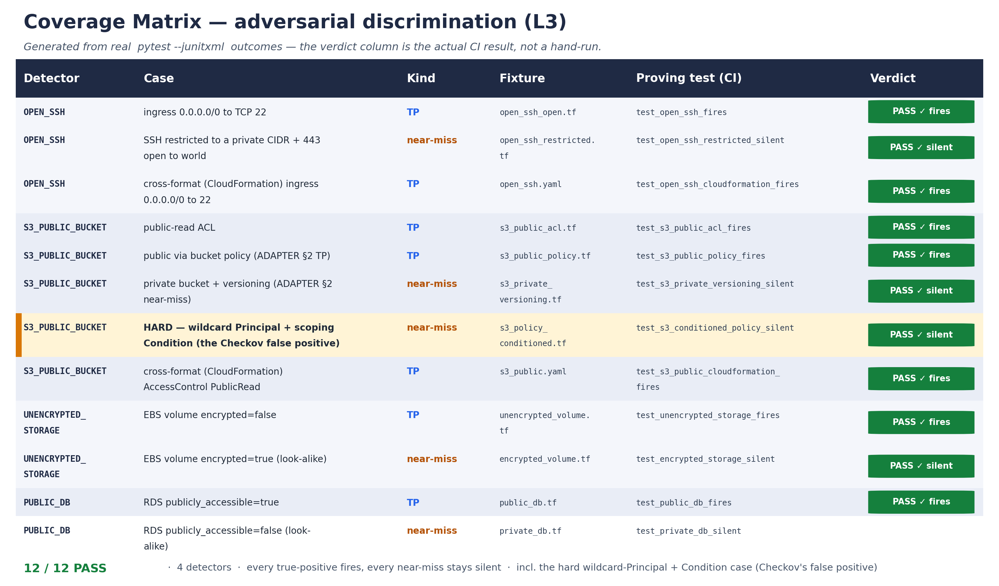
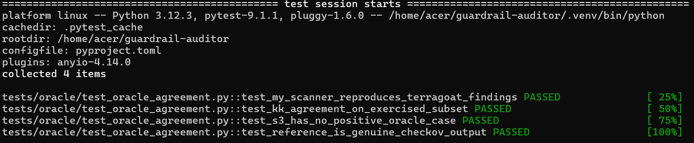
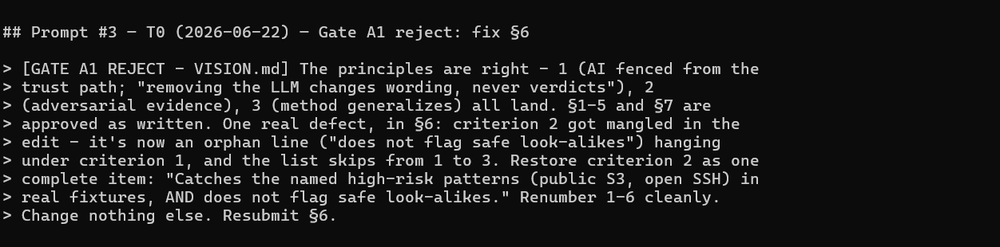

# Guardrail Auditor — Submission Deck

*Every claim on these slides ties to a repo artifact. P2 is fully built; the
method is proven generic; P1/P3 are ready-to-execute specs — not built. No
invented metrics.*

---

## 1. Compliance copilot for Wolters Kluwer

Wolters Kluwer's business is **audit, compliance, and risk** (e.g. TeamMate). The
same job, applied to cloud infrastructure:

- **Project 2 — a compliance copilot for Infrastructure-as-Code.** It reads
  Terraform / CloudFormation, flags high-risk patterns, and speaks the auditor's
  language — CIS, SOC 2, ISO 27001, GDPR.
- **Shift-left:** the cheapest place to catch a compliance failure is the pull
  request, not production.
- Static, deterministic, **no cloud and no API key** to run.

*Source: `README.md`, `VISION.md`.*

---

## 2. The product — flag, explain, map, score, fix

A finding isn't a raw line number — it's an auditable, control-mapped, fixable
result:

- **Plain-language explanation** of each risk.
- **Named control mapping** — CIS AWS v3.0.0 · SOC 2 CC6.1 · ISO 27001:2022 · GDPR Art. 32.
- **Visual 0–100 Risk Score** + grade (severity-weighted, deterministic).
- **Remediation** — the corrected snippet / CLI action that closes the *same*
  control the finding cites.
- Two inputs, one abstraction: **upload files** or **paste a public repo URL**.

*Source: `dashboard.png`, `core/compliance.py`, `core/remediation.py`.*

---

## 3. The method — one agent, five hats, two gates

A single agent switches between five named hats under an approved, project-agnostic
`PROTOCOL.md`:

- **PLANNER / BUILDER / VERIFIER / SCRIBE / REPORTER**, with a **two-gate loop per
  sprint** (approve the plan, then approve the evidence) and an **L1/L2/L3
  validation ladder** (lint+type+tests · conformance · adversarial pairs).
- **The independent VERIFIER** is the keystone: a **separate context window**,
  **Read/Grep/Bash only** — it audits the repo artifacts, **not the builder's
  reasoning**. That's **structural assurance through context isolation — not
  model independence**.

*Source: `PROTOCOL.md`, `.claude/agents/verifier.md`.*

---

## 4. Assurance — two distinct streams

Not one number — two independent lines of evidence:

- **Coverage matrix (own corpus):** every detector fires on its true-positive and
  stays silent on a safe look-alike — **12/12 PASS**, including the hard
  wildcard-Principal + `Condition` false positive. Generated from real
  `pytest --junitxml` output, guarded against drift.
- **External oracle:** **Checkov 3.2.334 × TerraGoat** (pinned), **K→K agreement
  3/3** on the subset TerraGoat exercises.

> **"Checkov validates; the copilot differentiates."** This is *not* a homemade
> Checkov — it agrees with Checkov where they overlap, then adds control-mapping,
> explanation, and remediation.

*Source: `docs/coverage_matrix.md`, `tests/oracle/` (`SOURCES.md`, `checkov_reference.json`).*

---

## 5. Human-in-the-loop — gates with teeth

The gates aren't ceremony. A real rejection at the very first foundation gate,
before the vision could be locked:

- At **Gate A1**, the architect **rejected** the `VISION.md` draft. The principles
  were approved — but **§6, criterion 2 had been mangled into an orphan line**
  ("does not flag safe look-alikes" left dangling under criterion 1, the
  success-criteria list skipping from 1 to 3).
- Restored as one complete criterion, resubmitted, approved. A human caught a
  real structural defect **before it became the foundation** everything else
  built on.

*Source: `gate-rejection.png`, `prompts.md` (Prompt #3 — Gate A1 reject, VISION.md §6).*

---

## 6. The recursive audit

Wolters Kluwer's own business — applied to the submission itself. Three layers of
audit, each a real artifact:

- **The tool audits the configs** — detectors → findings → Risk Score.
- **The matrix audits the tool** — 12/12 discrimination, true-positive fires /
  near-miss silent, sourced from CI.
- **`prompts.md` audits the human** — **42 logged prompts** (#0 is the mandated
  Lead-Architect opener; one flagged duplicate at #17), every architect gate on
  the record.

Audit all the way down.

*Source: `coverage_matrix.md`, `prompts.md`, `audit/`.*

---

## 7. One method, three detectors — the seam

The same `PROTOCOL.md` drives every module; **only `ADAPTER.md`'s two clauses
swap**:

| | clause 1 — domain layer | clause 2 — L3 false-positive trap |
|---|---|---|
| **P2** (built) | finding → named control → **Risk Score** | public-via-policy bucket flags; private+versioning doesn't |
| **P1** FinOps | waste → FinOps category → **$-saved** | orphaned ≥30d disk flags; attached/low-IO **doesn't** (idle ≠ orphaned) |
| **P3** SRE | anomaly → SLO/error-budget → **Health Score** | 10× error spike fires the webhook; benign burst **doesn't** |

Identical across all three: detector → discrimination pair · deterministic
aggregate score · map-to-named-taxonomy · matrix + oracle assurance. That's what
turns *three projects* into *one method*.

*Source: `future-modules/`, `memory/decisions.md`, `ADAPTER.md`.*

---

## 8. Proof, not promise

The seam isn't a claim — it's two **build-ready specifications**:

- `future-modules/P1-finops/EPIC.md` — Cloud Cost Optimizer.
- `future-modules/P3-sre/EPIC.md` — Observability & Event Watchdog.

Each reuses `PROTOCOL.md` / `CLAUDE.md` / `verifier.md` unchanged, swaps only the
adapter's 2 clauses, and decomposes into the same S0–S8 sprints — with each S2
**requiring its true-positive + near-miss discrimination pair as committed CI
tests**.

**Honest status:** P2 is fully built and on the remote; P1 and P3 are
**ready-to-execute specs, not built**.

*Source: the two `EPIC.md` files.*

---

## 9. Land & expand + roadmap — honesty as the product

For an audit tool, the credibility *is* the product. Where the work corrected
itself, on the record in `LIMITATIONS.md`:

- **Severity corrected** `PUBLIC_DB` critical → high (verified against the current
  Trivy rego, not asserted from memory).
- **CIS version drift** caught — S3 Block-Public-Access is **§2.1.4** in v3.0.0,
  not v1.4's §2.1.5.
- **RDS sub-number not verifiable** → cited at **section level §2.3** with a
  visible `(section)` marker, rather than fabricate a control id.
- **K→K reported 3/3, not padded to 4/4** — TerraGoat has no positive S3 case, so
  it isn't counted.

**Roadmap:** more detectors + allowlist hosts · the S3 block-public-access check ·
fenced LLM narration — *never in the trust path*.

**Build at a glance:** 4 detectors · 12/12 matrix · K→K 3/3 · **88 tests green** ·
S0–S8 + P1/P3 specs · `github.com/patw47/guardrail-auditor`.

*Source: `LIMITATIONS.md`, `decisions.md`, `coverage_matrix.md`.*
